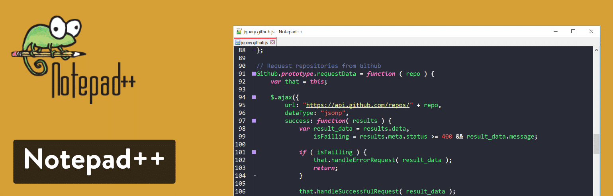

## Text Editor
* [Visual Studio Code](https://code.visualstudio.com/)
    

* [Atom](https://atom.io/)
    

* [Sublime Text](https://www.sublimetext.com/3)
    

* [Notepad++](https://notepad-plus-plus.org/downloads/)
    

* [Vim](https://www.vim.org/download.php)
    

## Tools
* [Git](https://git-scm.com/downloads)
    

* [GitHub Desktop](https://desktop.github.com/)
    

* [GitKraken](https://www.gitkraken.com/pricing)
    

* [Firebase](https://www.gitkraken.com/pricing)
    

## Reference
- [W3Schools](https://www.w3schools.com/)
- [Free Code Camp](https://www.freecodecamp.org/)
- [CodinGame](https://www.codingame.com/start)
- [Codecademy](https://www.codecademy.com/)
- [Khan Academy](https://www.khanacademy.org/)
- [General Assembly Dash](https://dash.generalassemb.ly/)

## Bonus
- [GitHub Student Pack](https://education.github.com/pack)
    - [**GitHub:**](https://github.com/) Free GitHub Pro while you are a student.
    - [**Canva:**](https://www.canva.com/) Free 12 month subscription of Canva's Pro tier.
    - [**Unity:**](https://unity.com/) Unity Student Plan free while you are a student.
    - [**JetBrains:**](https://www.jetbrains.com/products/) A free subscription for students, to be renewed annually.
    - [**Name.com:**](https://www.name.com/partner/github-students) One free domain name and free Advanced Security (SSL, privacy protection, and more).
    - [And many more...](https://education.github.com/pack)
